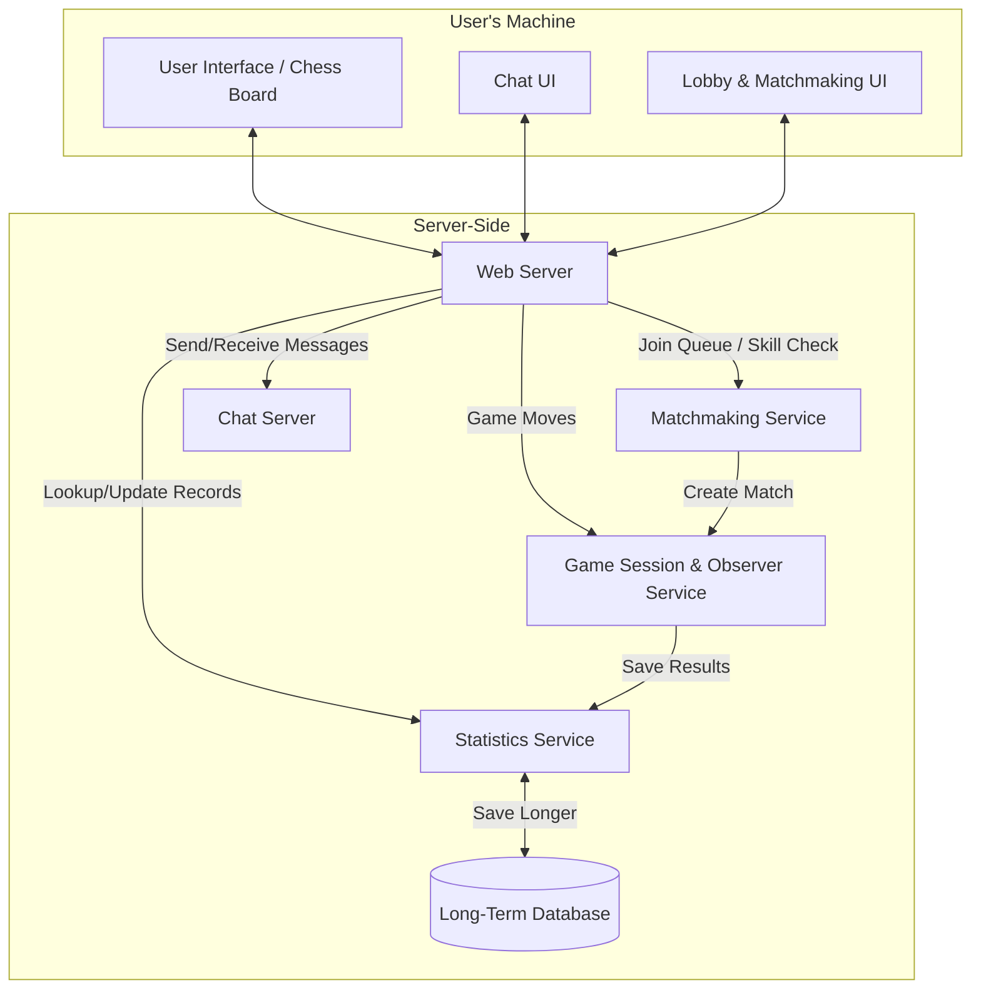
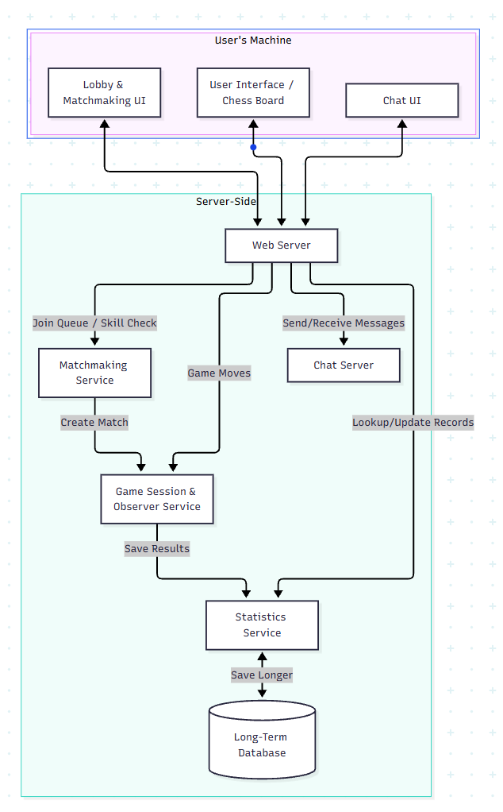

Joshua Samuel

# Challenge 4.5: Component Diagram

```mermaid
flowchart TB
    subgraph Client ["User's Machine"]
        UI[User Interface / Chess Board]
        ClientChat[Chat UI]
        ClientLobby[Lobby & Matchmaking UI]
    end

    subgraph Server ["Server-Side"]
        WebServer[Web Server]
        Matchmaking[Matchmaking Service]
        GameEngine[Game Session & Observer Service]
        ChatServer[Chat Server]
        StatsService[Statistics Service]
        DB[(Long-Term Database)]
    end

    UI <--> WebServer
    ClientChat <--> WebServer
    ClientLobby <--> WebServer

    WebServer -->|Join Queue / Skill Check| Matchmaking
    WebServer -->|Game Moves| GameEngine
    WebServer -->|Send/Receive Messages| ChatServer
    WebServer -->|Lookup/Update Records| StatsService

    Matchmaking -->|Create Match| GameEngine
    GameEngine -->|Save Results| StatsService
    StatsService <-->|Save Longer| DB
```

